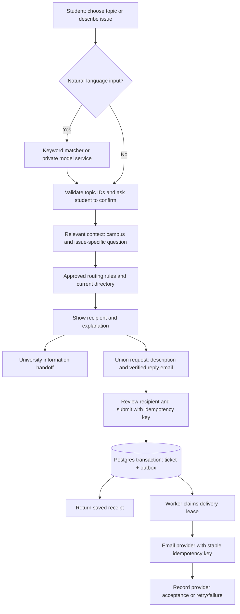

# Service architecture

The model has no email or database tools. The API ignores no client-supplied authority: it rejects unrecognized fields, derives the requester from verified authentication, resolves the recipient itself and verifies the recipient matches the student's review.

Demo mode stops at a local draft. Live mode requires the approved directory, Supabase, authentication email setup, a verified sending provider and operational readiness. The diagram's university handoff is guidance; it does not automatically share a student's message outside the union.
