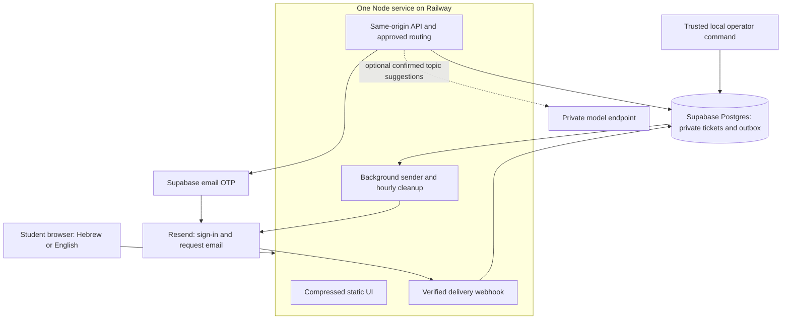

# Service architecture

The pilot has one application deployment and two external providers. The browser talks to the app on one origin. No runtime npm packages, separate queue server, frontend hosting service or public admin console are required.

The student selects a topic or confirms a keyword/model suggestion, answers only relevant context questions, reviews a resolved recipient, verifies their reply address and submits. The API derives identity from Supabase Auth, rejects client-supplied recipient addresses, and checks that the directory and privacy notice match what was reviewed.

Ticket and outbox writes commit atomically. A leased sender uses a frozen payload and stable provider idempotency key. Both callback ingestion and provider acknowledgement reconcile under a consistent provider/outbox lock order. Duplicates and late temporary events cannot undo a terminal delivery outcome. A single instance is sufficient for a pilot; database leases preserve work across restarts and allow later replication.

The model has no email, database or tool access. It can only suggest validated topic IDs, which the student must confirm. Manual selection and local keyword matching remain available without an AI provider. The first launch should leave inference disabled until an independent Hebrew evaluation and a hosting decision are complete.

University routing is an information handoff; no student text is automatically sent to university staff. Current department-level links remain general guidance. The staff PDF establishes union role mailboxes, not precise university responsibility rules.

`config/directory.json` owns recipient routing; `config/service.json` owns the reviewed notice and retention period. Local operations give administrators queue counts and basic case-status/deletion commands. Staff use existing mailboxes for replies; this is not an ingested conversation system.

This architecture reduces deployed components while retaining managed authentication, a durable database and a mail provider. Those services and the application's own security controls still need regular updates, limited credentials, operational ownership and staging verification. See [setup](setup.md) and [operations](operations.md).
